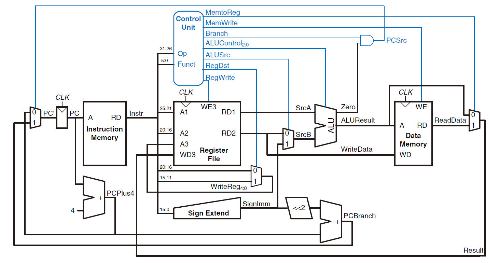

## 设计草稿

将一个简单的单周期CPU拆分成`IFU`、`GRF`、`ALU`、`DM`、`Controller`五个模块，通过`MUX`等形成数据通路。

**支持的指令：**`add`、`sub`、`ori`、`lw`、`sw`、`beq`、`lui`、`nop`、`jal`、`jr`

**注意点：**

* 复位信号reset采用**同步复位**方式
* `add`、`sub`按无符号运算处理，等同于`addu`、`subu`
* `Memory`相关组件（如IM、DM）**按字寻址**，地址接入时应注意去除末2位。

**设计参考图：**(实际设计有删改)



**IFU（取指令单元）：**

* 内部包括 PC（程序计数器）、IM（指令存储器）及相关逻辑
* PC 用寄存器实现，具有复位功能，复位值为起始地址
* 地址区间：0x00003000~0x00006FFF
* IM 用 `reg变量数组`堆叠 实现，容量为$1字\times 2^{12} = 32\textrm{bit}\times 4096$
* IM 实际地址宽度为 14 位，需要使用恰当的方法将 PC 中储存的地址同 IM 联系起来（**偏移**+**截尾**）
* 通过`npc_sel`控制信号（`2位`，来自控制器）选择下一条指令的地址计算方式，具体见下表

| 控制信号[1:0] |            NPC计算方式             |
| :-----------: | :--------------------------------: |
|   NPC_ADD4    |            npc = pc + 4            |
|  NPC_OFFSET   |   npc = pc + 4 + (imm32 \|\| 00)   |
|  NPC_JUMP_S   | npc = pc[31:28] \|\| imm26 \|\| 00 |
|  NPC_JUMP_L   |            npc = imm32             |

**GRF（通用寄存器组）：**

* 用具有写使能的寄存器实现，寄存器总数为 32 个，具有复位功能
* 0 号寄存器的值始终保持为 0。其他寄存器初始值（复位后）为 0

**ALU（算术逻辑单元）：**

* 通过`op`控制信号（`4位`）选择对应的计算功能，具体见下表

* 提供 32 位加、减、或、LUI运算及逻辑等于比较功能

* 加、减法按无符号处理，不考虑溢出

  | 控制信号[3:0] |                  ALU功能                  |
  | :-----------: | :---------------------------------------: |
  |   ALUOP_ADD   |                无符号加法                 |
  |   ALUOP_SUB   |                无符号减法                 |
  |   ALUOP_ORI   |     寄存器值逻辑或立即数（高16位补0）     |
  |   ALUOP_LUI   |      立即数置输出高16位（低16位补0）      |
  |   ALUOP_EQU   | 输出等于逻辑真值（最低位有效，其余位补0） |

**DM（数据存储器）：**

* 使用`reg变量数组`堆叠实现，容量为$1字\times 2^{10}\times 3 = 32\textrm{bit}\times 3072$，具有复位功能，复位时清空所有内存为0
* 起始地址0x00000000
* 读写端口分离

**Controller（控制器）：**

* 采用聚焦于**控制信号每种取值所对应的指令**的方式

* 具体见下表

  | 指令 \ 控制信号 | RegDst[1:0] | RegSrc[1:0] | ALUCtr[3:0] | ALUSrc | RegWrite | MemWrite |   NPC[1:0]   | ImmSrc |
  | :-------------: | :----: | :----: | :-------: | :----: | :------: | :------: | :--------: | :-------: |
  |       add       |   01   |   00   | ALUOP_ADD |   0    |    1     |    0     |  NPC_ADD4  |-|
  |       sub       |   01   |   00   | ALUOP_SUB |   0    |    1     |    0     |  NPC_ADD4  |-|
  |       lui       |   00   |   00   | ALUOP_LUI |   1    |    1     |    0     |  NPC_ADD4  |-|
  |       ori       |   00   |   00   | ALUOP_ORI |   1    |    1     |    0     |  NPC_ADD4  |-|
  |       sw        |   -    |   -    | ALUOP_ADD |   1    |    0     |    1     |  NPC_ADD4  |-|
  |       lw        |   00   |   01   | ALUOP_ADD |   1    |    1     |    0     |  NPC_ADD4  |-|
  |       beq       |   -    |   -    |     ALUOP_EQU     |   0    |    0     |    0     | NPC_OFFSET / NPC_ADD4 |0|
  |       nop       |   -    |   -    |     -     |   -    |    0     |    0     |  NPC_ADD4  |-|
  |       jal       | 10 | 10 |     -     | - |    1     |    0     | NPC_JUMP_S |-|
  |       jr        | - | 00 |     ALUOP_ADD     | 0 |    0     |    0     |  NPC_JUMP_L  |1|

## 思考题

### Q：阅读下面给出的 DM 的输入示例中（示例 DM 容量为 4KB，即 32bit × 1024字），根据你的理解回答，这个 addr 信号又是从哪里来的？地址信号 addr 位数为什么是 [11:2] 而不是 [9:0] ？

A：addr信号来自于`PC`。该`DM`选址方式为按字选址，使用[11:2]更能体现出这种选址方式，且在代码中具有提示作用。

### Q：思考上述两种控制器设计的译码方式，给出代码示例，并尝试对比各方式的优劣。

A：示例代码：

```verilog
// 1.指令对应的控制信号如何取值
if (add) begin
    RegWrite = 1;
    ALUCtr = 0;
    ......
end else if(sw) begin
    RegWrite = 0;
    MemWrite = 1;
    ......
end ...
//============================
// 2.控制信号每种取值所对应的指令
MemWrite = sw;
RegWrite = add || sub || lui || ...;
......
//============================
```

对于`指令对应的控制信号如何取值`的方式，其直观易懂，易于扩展，但支持指令多了以后代码就显得较为冗长；对于`控制信号每种取值所对应的指令`的方式，其在支持更多指令后代码也能保持相对精简，但代码可读性差，不便扩展。

### Q：在相应的部件中，复位信号的设计都是**同步复位**，这与 P3 中的设计要求不同。请对比**同步复位**与**异步复位**这两种方式的 reset 信号与 clk 信号优先级的关系。

A：同步复位时，`clk`信号优先级大于`reset`信号，只有`clk`信号上升沿到来时才继续判断`reset`信号是否为高电平。异步复位时，`reset`信号优先级大于`clk`信号，`reset`信号为高电平时直接复位，`reset`信号为低电平且`clk`信号上升沿到来时才执行时序操作。

### Q：C 语言是一种弱类型程序设计语言。C 语言中不对计算结果溢出进行处理，这意味着 C 语言要求程序员必须很清楚计算结果是否会导致溢出。因此，如果仅仅支持 C 语言，MIPS 指令的所有计算指令均可以忽略溢出。 请说明为什么在忽略溢出的前提下，addi 与 addiu 是等价的，add 与 addu 是等价的。

A：因为`addi`、`addiu`、`add`、`addu`在`ALU`中进行的都是**无符号**加法运算，非`u`系列指令只是在`u`系列指令操作的基础上再加溢出检测与异常抛出流程。因此在忽略溢出的前提下，addi 与 addiu 是等价的，add 与 addu 是等价的。
