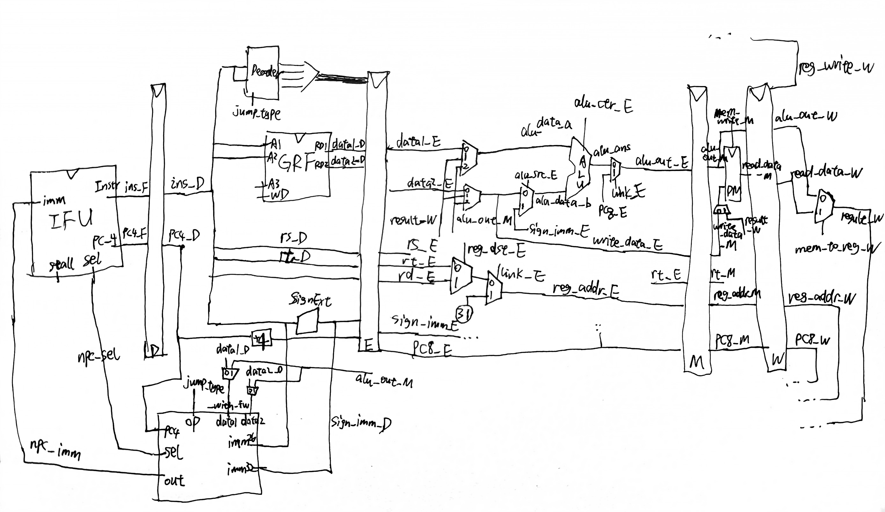

## 设计草稿

将一个简单的流水线CPU拆分成`IFU`、`NPC`、`GRF`、`ALU`、`DM`、`Decoder`等功能模块与`StageD`、`StageE`、`StageM`、`StageW`流水线寄存器与一个`ConflictController`冲突控制器，通过`MUX`合成数据通路。

**支持的指令：**`add`、`sub`、`ori`、`lw`、`sw`、`beq`、`lui`、`nop`、`jal`、`jr`

**注意点：**

* 复位信号reset采用**同步复位**方式
* `add`、`sub`按无符号运算处理，等同于`addu`、`subu`
* `Memory`相关组件（如IM、DM）**按字寻址**，地址接入时应注意去除末2位。
* 转发操作完全依靠级间时序与寄存器号进行判别，具体进行转发的级有`M->E`、`W->E`、`W->M`、`M->D`（跳转**提前计算**）、`W->D`（GRF**内部转发**）
* 实际处理阻塞时并未完全采用AT法，采用了一种引入`A`因素，弱化`Tuse`属性并使用其他条件替换`Tnew`属性的阻塞判别法。

**数据通路图：**

**IFU（取指令单元/F级寄存器）：**

* 内部包括 PC（程序计数器）、IM（指令存储器）及相关逻辑
* PC 用寄存器实现，具有复位功能，复位值为起始地址
* 地址区间：0x00003000~0x00006FFF
* IM 用 `reg变量数组`堆叠 实现，容量为$1字\times 2^{12} = 32\textrm{bit}\times 4096$
* IM 实际地址宽度为 14 位，需要使用恰当的方法将 PC 中储存的地址同 IM 联系起来（**偏移**+**截尾**）
* 通过`sel`控制信号（来自`NPC`模块）选择下一条指令的地址，0时nextPC默认+4，1时从`NPC`接收32位`imm`作为nextPC
* **支持通过`Stall`控制信号阻塞PC更新，即阻塞F级**

**NpcController（NextPC计算单元）：**

* 接收来自`Decoder`的`jump_type`（4位）控制信号，选择NextPC计算方式
* 用于计算、判断的输入有`data1_with_fw`、`data2_with_fw`（来自`GRF`+M级转发），imm26、imm32

| 控制信号[3:0] |                         NPC计算方式                         |
| :-----------: | :---------------------------------------------------------: |
|   JUMP_NONE   |                        npc = pc + 4                         |
|   JUMP_BEQ    | npc = (data1==data2) ? (pc + 4 + (imm32 \|\|00)) : (pc + 4) |
|   JUMP_JAL    |             npc = pc[31:28] \|\| imm26 \|\| 00              |
|    JUMP_JR    |                         npc = data1                         |

**GRF（通用寄存器组）：**

* 用具有写使能的寄存器实现，寄存器总数为 32 个，具有复位功能
* 0 号寄存器的值始终保持为 0。其他寄存器初始值（复位后）为 0
* **支持内部转发，即当写使能启用且读寄存器与写寄存器相同时（0号寄存器除外），应先在对应端口输出写数据**

**ALU（算术逻辑单元）：**

* 通过`op`控制信号（4位）选择对应的计算功能，具体见下表

* 加、减法按无符号处理，不考虑溢出

  | 控制信号[3:0] |              ALU功能              |
  | :-----------: | :-------------------------------: |
  |   ALUOP_ADD   |            无符号加法             |
  |   ALUOP_SUB   |            无符号减法             |
  |   ALUOP_ORI   | 寄存器值逻辑或立即数（高16位补0） |
  |   ALUOP_LUI   |  立即数置输出高16位（低16位补0）  |

**DM（数据存储器）：**

* 使用`reg变量数组`堆叠实现，容量为$1字\times 2^{10}\times 3 = 32\textrm{bit}\times 3072$，具有复位功能，复位时清空所有内存为0
* 起始地址0x00000000
* 读写端口分离

**Decoder（译码器）：**

* 采用聚焦于**控制信号每种取值所对应的指令**的方式

  | 指令 \ 控制信号 | RegDst | MemToReg | ALUCtr[3:0] | ALUSrc | RegWrite | MemWrite |   JType[3:0]   | Link |
  | :-------------: | :----: | :----: | :-------: | :----: | :------: | :------: | :--------: | :-------: |
  |       add       |   1   |   0   | ALUOP_ADD |   0    |    1     |    0     |  JUMP_NONE  |0|
  |       sub       |   1   |   0   | ALUOP_SUB |   0    |    1     |    0     |  JUMP_NONE  |0|
  |       lui       |   0   |   0   | ALUOP_LUI |   1    |    1     |    0     |  JUMP_NONE  |0|
  |       ori       |   0   |   0   | ALUOP_ORI |   1    |    1     |    0     |  JUMP_NONE  |0|
  |       sw        |   -    |   -    | ALUOP_ADD |   1    |    0     |    1     |  JUMP_NONE  |-|
  |       lw        |   0   |   1   | ALUOP_ADD |   1    |    1     |    0     |  JUMP_NONE  |0|
  |       beq       |   -    |   -    |     -     |   -    |    0     |    0     | JUMP_BEQ |-|
  |       nop       |   -    |   -    |     -     |   -    |    0     |    0     |  JUMP_NONE  |-|
  |       jal       | - | 0 |     -     | - |    1     |    0     | JUMP_JAL |1|
  |       jr        | - | - |      -      | - |    0     |    0     |  JUMP_JR  |-|

| 指令 \ 控制信号 | RsUsage[1:0] | RtUsage[1:0] |
| :-------------: | :----: | :----: |
| add / sub | VALUE_USE_NEXT | VALUE_USE_NEXT |
| lui | VALUE_USE_NONE | VALUE_USE_NONE |
| ori | VALUE_USE_NEXT | VALUE_USE_NONE |
| sw | VALUE_USE_NEXT | VALUE_USE_NONE[^1] |
| lw | VALUE_USE_NEXT | VALUE_USE_NONE |
| beq | VALUE_USE_NOW | VALUE_USE_NOW |
| nop | VALUE_USE_NEXT[^2] | VALUE_USE_NEXT[^2] |
| jal | VALUE_USE_NONE | VALUE_USE_NONE |
| jr | VALUE_USE_NOW | VALUE_USE_NONE |

[^1]: `sw`指令的`rt`值在M级才会使用到，此时其前序指令均已计算/取出完成，可通过W->M转发保证正确性，故使用`VALUE_USE_NONE`
[^2]: `nop`为特殊的`sll`指令，由于`rs`、`rt`寄存器均为0，故不会触发阻塞

**ConflictController（冲突处理器）：**

* 阻塞优先级总是大于转发、清空（如有）等冲突处理操作
* 来自前序的转发优先级大于更前序几级（就近法则）
* 当满足转发条件时（0号寄存器除外），总是进行转发。具体进行转发的级有`M->E`、`W->E`、`W->M`、`M->D`（跳转提前计算），`W->D`为特殊的GRF内部转发
* 总是将指令阻塞在D级，同时F级也阻塞，E级清空（即插入指令空泡）
* 采用改进版AT法判定阻塞条件，保留`A`因素（0号寄存器除外），弱化`Tuse`属性成`VALUE_USE_NOW`、`VALUE_USE_NEXT`、`VALUE_USE_NONE`三种信号并使用`RegWrite`与`MemToReg`控制信号代替`Tnew`属性进行判定

**StageX（流水线寄存器）：**

* `reset`复位信号优先级最高

* StageF（取指）：实际上为PC寄存器，支持**Stall阻塞**，传递当前PC**+4**的值
* StageD（译码）：支持**Stall阻塞**，传递当前PC**+4**的值
* StageE（执行）：支持**Flush清空**，传递当前PC**+8**的值
* StageM（访存）：传递当前PC**+8**的值
* StageW（回写）：传递当前PC**+8**的值

## 思考题

### Q：在课上测试时，我们需要你现场实现新的指令，对于这些新的指令，你可能需要在原有的数据通路上做哪些扩展或修改？

A：对于计算指令，可能需要扩展ALU功能；对于内存指令，可能需要构造额外的判断模块接入数据通路，需要额外的读->写数据回路以支持半字、字节读写；对于跳转指令，可能需要构造额外的判断、取寄存器值模块接入数据通路，必要时可能要更新阻塞/清空模式。

### Q：简要描述你的译码器架构，并思考该架构的优势以及不足。

A：我的译码器采用聚焦于**控制信号每种取值所对应的指令**的方式，其在支持更多指令后代码也能保持相对精简，但代码可读性差，不便扩展。

### Q：我们使用提前分支判断的方法尽早产生结果来减少因不确定而带来的开销，但实际上这种方法并非总能提高效率，请从流水线冒险的角度思考其原因并给出一个指令序列的例子。

A：分支提前了一个级判断，导致存在三个流水线级别可能与D级发生数据冒险，即E->D级、M->D级、W->D级，其中W->D级可通过GRF内部转发解决，而最坏情况下一条跳转会因为E->D级、M->D级的冲突阻塞两次。例：`lw-beq`指令序列，其中`lw`指令待写的寄存器是beq需要判断的寄存器之一（0号寄存器除外）。

### Q：因为延迟槽的存在，对于 jal 等需要将指令地址写入寄存器的指令，要写回 PC + 8，请思考为什么这样设计？

A：因为延迟槽中的指令位于`jal`指令下一条位置（即PC+4），其视为跳转指令的一条附属指令；而`jal`指令一般与`jr`指令配合进行过程、函数调用等操作，当调用完成返回时，延迟槽中的附属指令不应再被执行，返回后执行的第一条指令应为延迟槽后一条指令，即`jal`后两条指令。故写回PC + 4 + 4=PC + 8。

### Q：我们要求大家所有转发数据都来源于流水寄存器而不能是功能部件（如 DM、ALU），请思考为什么？

A：根据流水线CPU的设计原则，每个流水线寄存器都保存着一条指令完成后续操作所需要的的全部信息，即流水线寄存器保存着上一级流水线执行完成的结果，转发所需要的数据也应当是“完成的”，从功能部件获取的转发数据是不符合“完成”的条件的，有违流水线CPU设计原则。此外，如果转发数据来自功能部件，实际上是将两个流水线级串接了起来，这将大大增加单级流水线的关键路径长度，使流水线的设计得不偿失，失去其原本优势。

### Q：我们为什么要使用 GPR 内部转发？该如何实现？

A：为了解决W->D级的数据冒险问题。GRF模块中，当写使能启用且读寄存器与写寄存器相同时（0号寄存器除外），先在对应端口输出写数据。

### Q：我们转发时数据的需求者和供给者可能来源于哪些位置？共有哪些转发数据通路？

A：需求者：D级、E级、M级。供给者：M级、W级。转发通路：M->E、W->E、W->M、M->D、W->D。
