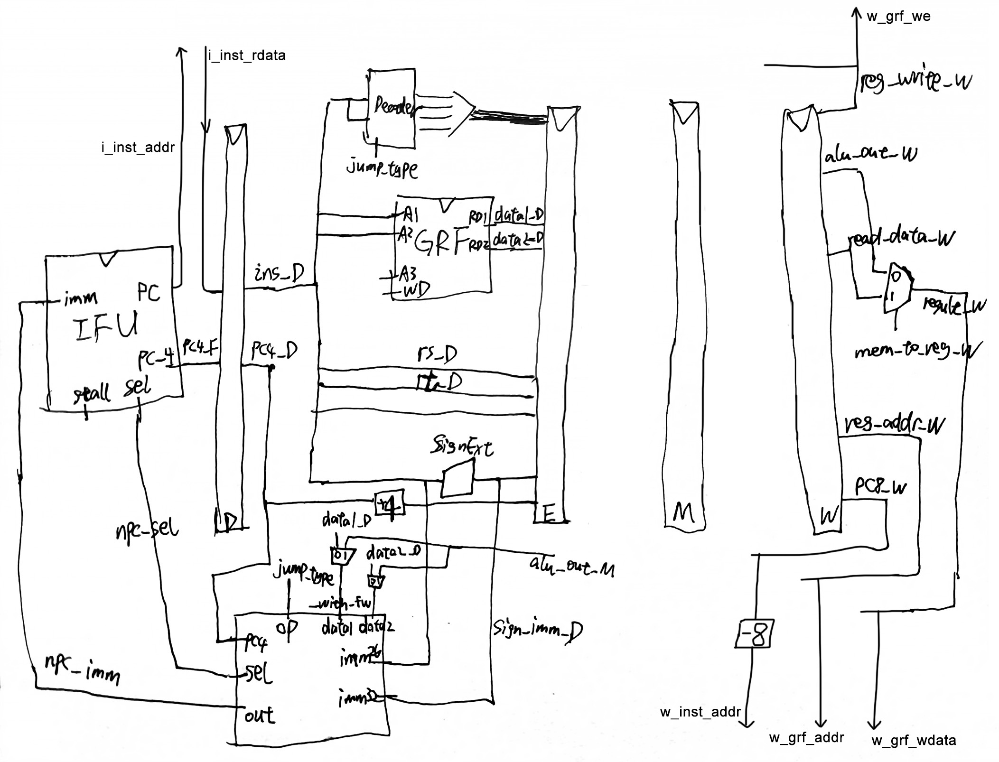
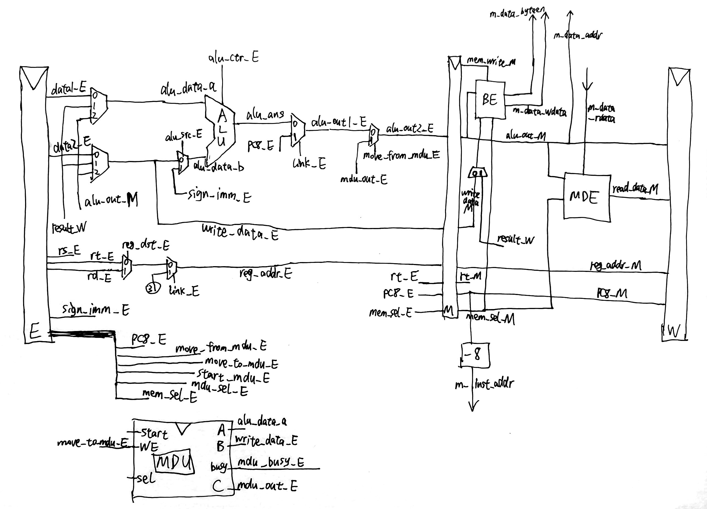

## 设计草稿

**支持的指令：**

```
add, sub, and, or, slt, sltu, lui
addi, andi, ori
lb, lh, lw, sb, sh, sw
mult, multu, div, divu, mfhi, mflo, mthi, mtlo
beq, bne, jal, jr
```

**注意点：**

* 复位信号reset采用**同步复位**方式
* `add`、`sub`等按无符号运算处理，等同于`addu`、`subu`等
* 转发操作完全依靠级间时序与寄存器号进行判别，具体进行转发的级有`M->E`、`W->E`、`W->M`、`M->D`（跳转**提前计算**）、`W->D`（GRF**内部转发**）
* 实际处理阻塞时并未完全采用AT法，采用了一种引入`A`因素，弱化`Tuse`属性并使用其他条件替换`Tnew`属性的阻塞判别法。

**数据通路图：**




**IFU（取指令单元/F级寄存器）：**

* 内部包括 PC（程序计数器）及相关逻辑
* PC 用寄存器实现，具有复位功能，复位值为起始地址
* 地址区间：0x00003000~0x00006FFF
* 通过`sel`控制信号（来自`NPC`模块）选择下一条指令的地址，0时nextPC默认+4，1时从`NPC`接收32位`imm`作为nextPC
* **支持通过`Stall`控制信号阻塞PC更新，即阻塞F级**
* IM模块已引出，用外部tb实现

**NpcController（NextPC计算单元）：**

* 接收来自`Decoder`的`jump_type`（4位）控制信号，选择NextPC计算方式
* 用于计算、判断的输入有`data1_with_fw`、`data2_with_fw`（来自`GRF`+M级转发），imm26、imm32

| 控制信号[3:0] |                         NPC计算方式                         |
| :-----------: | :---------------------------------------------------------: |
|   JUMP_NONE   |                        npc = pc + 4                         |
|   JUMP_BEQ    | npc = (data1==data2) ? (pc + 4 + (imm32 \|\|00)) : (pc + 4) |
|   JUMP_BNE    | npc = (data1!=data2) ? (pc + 4 + (imm32 \|\|00)) : (pc + 4) |
|   JUMP_JAL    |             npc = pc[31:28] \|\| imm26 \|\| 00              |
|    JUMP_JR    |                         npc = data1                         |

**GRF（通用寄存器组）：**

* 用具有写使能的寄存器实现，寄存器总数为 32 个，具有复位功能
* 0 号寄存器的值始终保持为 0。其他寄存器初始值（复位后）为 0
* **支持内部转发，即当写使能启用且读寄存器与写寄存器相同时（0号寄存器除外），应先在对应端口输出写数据**

**ALU（算术逻辑单元）：**

* 通过`op`控制信号（4位）选择对应的计算功能，具体见下表

* 加、减法按无符号处理，不考虑溢出

| 控制信号[3:0] |              ALU功能              |
| :-----------: | :-------------------------------: |
|   ALUOP_ADD   |            无符号加法             |
|   ALUOP_SUB   |            无符号减法             |
|   ALUOP_ORI   | 寄存器值按位或立即数（高16位补0） |
|   ALUOP_LUI   |  立即数置输出高16位（低16位补0）  |
|   ALUOP_AND   |              按位与               |
|   ALUOP_OR    |              按位或               |
|  ALUOP_ANDI   | 寄存器值按位与立即数（高16位补0） |
|   ALUOP_SLT   |        小于置位（有符号）         |
|  ALUOP_SLTU   |        小于置位（无符号）         |

**MDU（乘除法模块）：**

* 乘法运算需要5个时钟周期，除法运算需要10个时钟周期
* 使用`start`信号与`sel`信号选择计算方式并开启计算
* 当`busy`信号或`start`信号为1时，`mfhi`、`mflo`指令将被阻塞在D流水级
* 允许`mult`、`div`、`mthi`等指令打断正在运行的过程并覆盖过程

当`start`信号为1时，`sel`信号选择的计算方式如下表：

| 控制信号[2:0]  |     MDU功能      |
| :------------: | :--------------: |
| MULDIV_DO_MUL  |    有符号乘法    |
| MULDIV_DO_MULU |    无符号乘法    |
| MULDIV_DO_DIV  | 有符号整除、取模 |
| MULDIV_DO_DIVU | 无符号整除、取模 |

**BE（字节使能模块）：**

对待写入内存的寄存器数据进行预处理，并输出字节使能信号到外置DM。选择信号与MDE模块共用。具体见下表

| MemWrite |  MemSel[2:0]   | AddrLow[1:0] | ByteEn[3:0] |      数据处理方式      |
| :------: | :------------: | :----------: | :---------: | :--------------------: |
|    1     | MEM_STORE_WORD |      -       |    1111     |         不处理         |
|    1     | MEM_STORE_HALF |      0x      |    0011     |         不处理         |
|    1     | MEM_STORE_HALF |      1x      |    1100     | {RawData[15:0], 16'b0} |
|    1     | MEM_STORE_BYTE |      00      |    0001     |         不处理         |
|    1     | MEM_STORE_BYTE |      01      |    0010     | {RawData[23:0], 8'b0}  |
|    1     | MEM_STORE_BYTE |      10      |    0100     | {RawData[15:0], 16'b0} |
|    1     | MEM_STORE_BYTE |      11      |    1000     | {RawData[7:0], 24'b0}  |
|    0     |       -        |      -       |    0000     |           -            |

**DM（数据存储器）：**已引出，用外部tb实现

**MDE（内存读取扩展模块）：**

对从内存读出的数据进行处理。选择信号与BE模块共用。具体见下表

|  MemSel[2:0]  | AddrLow[1:0] |        数据处理方式        |
| :-----------: | :----------: | :------------------------: |
| MEM_LOAD_WORD |      -       |           不处理           |
| MEM_LOAD_HALF |      0x      | signed_ext(RawData[15:0])  |
| MEM_LOAD_HALF |      1x      | signed_ext(RawData[31:16]) |
| MEM_LOAD_BYTE |      00      |  signed_ext(RawData[7:0])  |
| MEM_LOAD_BYTE |      01      | signed_ext(RawData[15:8])  |
| MEM_LOAD_BYTE |      10      | signed_ext(RawData[23:16]) |
| MEM_LOAD_BYTE |      11      | signed_ext(RawData[31:24]) |

**Decoder（译码器）：**

* 采用聚焦于**控制信号每种取值所对应的指令**的方式

| 指令 \ 控制信号 | RegDst | MemToReg | ALUCtr[3:0] | ALUSrc | RegWrite | MemWrite |   JType[3:0]   | Link |
| :-------------: | :----: | :----: | :-------: | :----: | :------: | :------: | :--------: | :-------: |
|       add       |   1   |   0   | ALUOP_ADD |   0    |    1     |    0     |  JUMP_NONE  |0|
|       sub       |   1   |   0   | ALUOP_SUB |   0    |    1     |    0     |  JUMP_NONE  |0|
|       lui       |   0   |   0   | ALUOP_LUI |   1    |    1     |    0     |  JUMP_NONE  |0|
|       ori       |   0   |   0   | ALUOP_ORI |   1    |    1     |    0     |  JUMP_NONE  |0|
|       beq       |   -    |   -    |     -     |   -    |    0     |    0     | JUMP_BEQ |-|
| bne | - | - | - | - | 0 | 0 | JUMP_BNE |-|
|       nop       |   -    |   -    |     -     |   -    |    0     |    0     |  JUMP_NONE  |-|
|       jal       | - | 0 |     -     | - |    1     |    0     | JUMP_JAL |1|
|       jr        | - | - |      -      | - |    0     |    0     |  JUMP_JR  |-|
|       and       |   1   |   0   | ALUOP_AND |   0    |    1     |    0     |  JUMP_NONE  |0|
| or | 1 | 0 | ALUOP_OR | 0 | 1 | 0 | JUMP_NONE |0|
| andi | 0 | 0 | ALUOP_ANDI | 1 | 1 | 0 | JUMP_NONE |0|
| addi | 0 | 0 | ALUOP_ADD | 1 | 1 | 0 | JUMP_NONE |0|
| slt | 1 | 0 | ALUOP_SLT | 0 | 1 | 0 | JUMP_NONE |0|
| sltu | 1 | 0 | ALUOP_SLTU | 0 | 1 | 0 | JUMP_NONE |0|

| 指令 \ 控制信号 | MemSel | RegDst | MemToReg | RegWrite | MemWrite | ALUCtr[3:0] | ALUSrc |
| :-------------: | :--------: | :----: | :----: | :-------: | :----: | :------: | :-------------: |
| sw | MEM_STORE_WORD | - | - | 0 | 1 | ALUOP_ADD | 1 |
| lw | MEM_LOAD_WORD | 0 | 1 | 1 | 0 | ALUOP_ADD | 1 |
| sh | MEM_STORE_HALF | - | - | 0 | 1 | ALUOP_ADD | 1 |
| lh | MEM_LOAD_HALF | 0 | 1 | 1 | 0 | ALUOP_ADD | 1 |
| sb | MEM_STORE_BYTE | - | - | 0 | 1 | ALUOP_ADD | 1 |
| lb | MEM_LOAD_BYTE | 0 | 1 | 1 | 0 | ALUOP_ADD | 1 |
| 其他指令 | - | … | 0 | … | 0 | … | … |

| 指令 \ 控制信号 | MoveFromMDU | MoveToMDU | MDUSel[2:0] | StartMDU | RegDst | RegWrite |
| :-------------: | :----: | :----: | :-------: | :----: | :------: | :--------: |
| mult | 0 | 0 | MULDIV_DO_MUL | 1 | - | 0 |
| multu | 0 | 0 | MULDIV_DO_MULU | 1 | - | 0 |
| div | 0 | 0 | MULDIV_DO_DIV | 1 | - | 0 |
| divu | 0 | 0 | MULDIV_DO_DIVU | 1 | - | 0 |
| mfhi | 1 | 0 | MULDIV_SELECT_HI | 0 | 1 | 1 |
| mflo | 1 | 0 | MULDIV_SELECT_LO | 0 | 1 | 1 |
| mthi | 0 | 1 | MULDIV_SELECT_HI | 0 | - | 0 |
| mtlo | 0 | 1 | MULDIV_SELECT_LO | 0 | - | 0 |
| 其他指令 | 0 | 0 | - | 0 | … | … |

| 指令 \ 控制信号 | RsUsage[1:0] | RtUsage[1:0] |
| :-------------: | :----: | :----: |
| add / sub | VALUE_USE_NEXT | VALUE_USE_NEXT |
| lui | VALUE_USE_NONE | VALUE_USE_NONE |
| ori | VALUE_USE_NEXT | VALUE_USE_NONE |
| sw / sh / sb | VALUE_USE_NEXT | VALUE_USE_NONE[^1] |
| lw / lh / lb | VALUE_USE_NEXT | VALUE_USE_NONE |
| beq | VALUE_USE_NOW | VALUE_USE_NOW |
| bne | VALUE_USE_NOW | VALUE_USE_NOW |
| nop / sll | VALUE_USE_NEXT[^2] | VALUE_USE_NEXT[^2] |
| jal | VALUE_USE_NONE | VALUE_USE_NONE |
| jr | VALUE_USE_NOW | VALUE_USE_NONE |
| and / or | VALUE_USE_NEXT | VALUE_USE_NEXT |
| andi | VALUE_USE_NEXT | VALUE_USE_NONE |
| addi | VALUE_USE_NEXT | VALUE_USE_NONE |
| slt / sltu | VALUE_USE_NEXT | VALUE_USE_NEXT |
| mult / multu / div /divu | VALUE_USE_NEXT | VALUE_USE_NEXT |
| mfhi / mflo[^3] | VALUE_USE_NONE | VALUE_USE_NONE |
| mthi / mtlo | VALUE_USE_NEXT | VALUE_USE_NONE |

[^1]: `sw/sh/sb`指令的`rt`值在M级才会使用到，此时其前序指令均已计算/取出完成，可通过W->M转发保证正确性，故使用`VALUE_USE_NONE`
[^2]: `nop`为特殊的`sll`指令，由于`rs`、`rt`寄存器均为0，故不会触发阻塞
[^3]: 使用独立于`RsUsage`、`RtUsage`之外的判据进行阻塞判定（`MoveFromMDU`、`StartMDU`、`MoveToMDU`与`MDUBusy`）

**ConflictController（冲突处理器）：**

* 阻塞优先级总是大于转发、清空（如有）等冲突处理操作
* 来自前序的转发优先级大于更前序几级（就近法则）
* 当满足转发条件时（0号寄存器除外），总是进行转发，即可能存在多余/错误的转发但由于阻塞或写使能未启用，未对实际状态产生错误影响。具体进行转发的级有`M->E`、`W->E`、`W->M`、`M->D`（跳转提前计算），`W->D`为特殊的GRF内部转发
* 总是将指令阻塞在D级，同时F级也阻塞，E级清空（即插入指令空泡）
* 采用改进版AT法判定阻塞条件，保留`A`因素（0号寄存器除外），弱化`Tuse`属性成`VALUE_USE_NOW`、`VALUE_USE_NEXT`、`VALUE_USE_NONE`三种信号并使用`RegWrite`与`MemToReg`控制信号代替`Tnew`属性进行判定
* 对于乘除器的阻塞，使用D级的`MoveFromMDU`信号与E级的`StartMDU`、`MoveToMDU`与`MDUBusy`信号进行额外的判定

**StageX（流水线寄存器）：**

* `reset`复位信号优先级最高

* StageF（取指）：实际上为PC寄存器，支持**Stall阻塞**，传递当前PC**+4**的值
* StageD（译码）：支持**Stall阻塞**，传递当前PC**+4**的值
* StageE（执行）：支持**Flush清空**，传递当前PC**+8**的值
* StageM（访存）：传递当前PC**+8**的值
* StageW（回写）：传递当前PC**+8**的值

## 思考题

### Q：为什么需要有单独的乘除法部件而不是整合进 ALU？为何需要有独立的 HI、LO 寄存器？

A：因为乘除法部件是一种时序逻辑模块，其完成一次计算需要花费数个时钟周期，其中的`LO`、`HI`寄存器更需要特殊的指令进行存取；而ALU是组合逻辑模块，其用于执行一些能快速完成的运算操作（如加法、比较等）。同时为了尽可能提升CPU的效率，将乘除法与ALU分离，满足一定条件时可以起到在E级进行“并行计算”的效果。因为乘除法模块的计算操作与取出结果操作是分离的，对于模块而言不能知道取结果的指令在何时到来，因此需要两个寄存器来临时地保存计算结果。

### Q：真实的流水线 CPU 是如何使用实现乘除法的？请查阅相关资料进行简单说明。

A：实际CPU中乘法算法有普通乘法、LUT乘法、Booth乘法等。普通乘法将乘法运算转换成多次加法运算并分配入时序中，具有速度慢、占资源少的特点；LUT乘法器即查找表乘法器，预存了一部分计算结果，具有速度快、占资源多的特点。除法器与乘法器类似，有移位相减除法、恢复余数除法、不恢复余数除法等多种算法，但耗时都大于乘法运算。

### Q：请结合自己的实现分析，你是如何处理 Busy 信号带来的周期阻塞的？

A：我的设计中，当`start`信号或`busy`信号为1时，只有D级指令需要取乘除法模块计算结果（即`mfhi`、`mflo`）时才将指令阻塞在D级，同时与常规阻塞条件取并；允许`mult`、`div`、`mthi`等指令打断正在运行的乘除法模块并覆盖，这也需要修改乘除法模块逻辑，使其可以接受指令覆盖。对于其他指令，由于其没有与乘除法模块产生任何交集，因此在不满足常规阻塞条件的情况下可以直接“放行”。

### Q：请问采用字节使能信号的方式处理写指令有什么好处？（提示：从清晰性、统一性等角度考虑）

A：清晰性：字节使能信号通过二进制形式直观反映了待写入内存的字节位，给调试带来极大便利。统一性：综合`sw`、`sh`、`sb`等指令为一个控制信号，同时也统一了MemWrite（内存写使能）的条件。

### Q：请思考，我们在按字节读和按字节写时，实际从 DM 获得的数据和向 DM 写入的数据是否是一字节？在什么情况下我们按字节读和按字节写的效率会高于按字读和按字写呢？

A：实际从DM获得的数据和向DM写入的数据并不是一字节，而是**一整字**。当实际内存或Cache的基本存储、访问单元为字节，且程序指令中存在大量对内存的读写单字节指令时，按字节读与按字节写的效率会显著高于按字读与按字写。

### Q：为了对抗复杂性你采取了哪些抽象和规范手段？这些手段在译码和处理数据冲突的时候有什么样的特点与帮助？

A：采用控制信号驱动型译码器，针对功能、所用数据通路相近的指令批量添加控制信号。使用宏定义控制信号，规范译码器与各功能部件之间的约定。采用了一种引入`A`因素，弱化`Tuse`属性并使用其他条件替换`Tnew`属性的阻塞判别法。这些手段极大地提升了译码的统一性、规范性，在处理数据冲突时条件清晰明了，易于扩展。

### Q：在本实验中你遇到了哪些不同指令类型组合产生的冲突？你又是如何解决的？相应的测试样例是什么样的？

A：主要由常规的、依靠转发即可解决的冲突与特殊的、需要阻塞来解决的冲突。主要讲处理阻塞的部分，阻塞主要由访存指令（即`lw`、`lh`、`lb`等）与乘除模块的占用引发。采用改进版AT法判定阻塞条件，保留`A`因素（0号寄存器除外），弱化`Tuse`属性成`VALUE_USE_NOW`、`VALUE_USE_NEXT`、`VALUE_USE_NONE`三种信号并使用`RegWrite`与`MemToReg`控制信号代替`Tnew`属性进行判定；对于乘除器的阻塞，使用D级的`MoveFromMDU`信号与E级的`StartMDU`、`MoveToMDU`与`MDUBusy`信号进行额外的判定。测试样例有`lw-add`、`lw-nop-add`、`lw-beq`、`lw-nop-beq`、`add-beq`、`mult-mflo`、`mult-nop-nop-mflo`等形式。

### Q：如果你是手动构造的样例，请说明构造策略，说明你的测试程序如何保证**覆盖**了所有需要测试的情况；如果你是**完全随机**生成的测试样例，请思考完全随机的测试程序有何不足之处；如果你在生成测试样例时采用了**特殊的策略**，比如构造连续数据冒险序列，请你描述一下你使用的策略如何**结合了随机性**达到强测的效果。

A：我的测试样例结合了随机生成与手动构造两种方式，完全随机的测试程序覆盖率明显不足，但能有效验证每条指令单独的实现的正确性；而手动构造则弥补了随机生成的缺陷，通过手动构造`lw-add`、`lw-nop-add`、`lw-beq`、`lw-nop-beq`、`add-beq`、`mult-mflo`、`mult-nop-nop-mflo`等两两、或两三条之间存在冲突的指令，枚举所有可能冲突的指令顺序，插入到随机指令序列前/中/后部，来保证一个较高的测试覆盖率，达到强测的效果。
