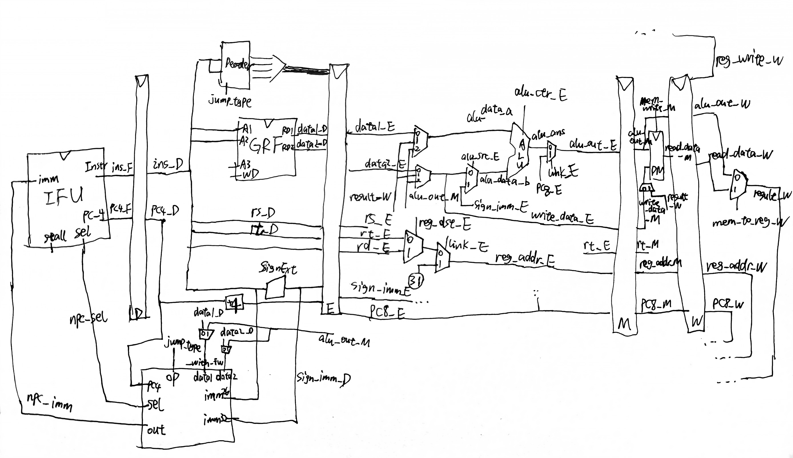

## 设计草稿

将一个简单的流水线CPU拆分成`IFU`、`NPC`、`GRF`、`ALU`、`DM`、`Decoder`等功能模块与`StageD`、`StageE`、`StageM`、`StageW`流水线寄存器与一个`ConflictController`冲突控制器，通过`MUX`合成数据通路。

**支持的指令：**`add`、`sub`、`ori`、`lw`、`sw`、`beq`、`lui`、`nop`、`jal`、`jr`

**注意点：**

* 复位信号reset采用**同步复位**方式
* `add`、`sub`按无符号运算处理，等同于`addu`、`subu`
* `Memory`相关组件（如IM、DM）**按字寻址**，地址接入时应注意去除末2位。
* 转发操作完全依靠级间时序与寄存器号进行判别，具体进行转发的级有`M->E`、`W->E`、`W->M`、`M->D`（跳转**提前计算**）、`W->D`（GRF**内部转发**）
* 实际处理阻塞时并未完全采用AT法，采用了一种引入`A`因素，弱化`Tuse`属性并使用其他条件替换`Tnew`属性的阻塞判别法。

**数据通路图：**

**IFU（取指令单元/F级寄存器）：**

* 内部包括 PC（程序计数器）、IM（指令存储器）及相关逻辑
* PC 用寄存器实现，具有复位功能，复位值为起始地址
* 地址区间：0x00003000~0x00006FFF
* IM 用 `reg变量数组`堆叠 实现，容量为$1字\times 2^{12} = 32\textrm{bit}\times 4096$
* IM 实际地址宽度为 14 位，需要使用恰当的方法将 PC 中储存的地址同 IM 联系起来（**偏移**+**截尾**）
* 通过`sel`控制信号（来自`NPC`模块）选择下一条指令的地址，0时nextPC默认+4，1时从`NPC`接收32位`imm`作为nextPC
* **支持通过`Stall`控制信号阻塞PC更新，即阻塞F级**

**NpcController（NextPC计算单元）：**

* 接收来自`Decoder`的`jump_type`（4位）控制信号，选择NextPC计算方式
* 用于计算、判断的输入有`data1_with_fw`、`data2_with_fw`（来自`GRF`+M级转发），imm26、imm32

| 控制信号[3:0] |                         NPC计算方式                         |
| :-----------: | :---------------------------------------------------------: |
|   JUMP_NONE   |                        npc = pc + 4                         |
|   JUMP_BEQ    | npc = (data1==data2) ? (pc + 4 + (imm32 \|\|00)) : (pc + 4) |
|   JUMP_JAL    |             npc = pc[31:28] \|\| imm26 \|\| 00              |
|    JUMP_JR    |                         npc = data1                         |

**GRF（通用寄存器组）：**

* 用具有写使能的寄存器实现，寄存器总数为 32 个，具有复位功能
* 0 号寄存器的值始终保持为 0。其他寄存器初始值（复位后）为 0
* **支持内部转发，即当写使能启用且读寄存器与写寄存器相同时（0号寄存器除外），应先在对应端口输出写数据**

**ALU（算术逻辑单元）：**

* 通过`op`控制信号（4位）选择对应的计算功能，具体见下表

* 加、减法按无符号处理，不考虑溢出

| 控制信号[3:0] |              ALU功能              |
| :-----------: | :-------------------------------: |
|   ALUOP_ADD   |            无符号加法             |
|   ALUOP_SUB   |            无符号减法             |
|   ALUOP_ORI   | 寄存器值按位或立即数（高16位补0） |
|   ALUOP_LUI   |  立即数置输出高16位（低16位补0）  |
|   ALUOP_AND   |              按位与               |
|   ALUOP_OR    |              按位或               |
|  ALUOP_ANDI   | 寄存器值按位与立即数（高16位补0） |
|   ALUOP_SLT   |        小于置位（有符号）         |
|  ALUOP_SLTU   |        小于置位（无符号）         |

**DM（数据存储器）：**

* 使用`reg变量数组`堆叠实现，容量为$1字\times 2^{10}\times 3 = 32\textrm{bit}\times 3072$，具有复位功能，复位时清空所有内存为0
* 起始地址0x00000000
* 读写端口分离

**Decoder（译码器）：**

* 采用聚焦于**控制信号每种取值所对应的指令**的方式

| 指令 \ 控制信号 | RegDst | MemToReg | ALUCtr[3:0] | ALUSrc | RegWrite | MemWrite |   JType[3:0]   | Link |
| :-------------: | :----: | :----: | :-------: | :----: | :------: | :------: | :--------: | :-------: |
|       add       |   1   |   0   | ALUOP_ADD |   0    |    1     |    0     |  JUMP_NONE  |0|
|       sub       |   1   |   0   | ALUOP_SUB |   0    |    1     |    0     |  JUMP_NONE  |0|
|       lui       |   0   |   0   | ALUOP_LUI |   1    |    1     |    0     |  JUMP_NONE  |0|
|       ori       |   0   |   0   | ALUOP_ORI |   1    |    1     |    0     |  JUMP_NONE  |0|
|       beq       |   -    |   -    |     -     |   -    |    0     |    0     | JUMP_BEQ |-|
| bne | - | - | - | - | 0 | 0 | JUMP_BNE |-|
|       nop       |   -    |   -    |     -     |   -    |    0     |    0     |  JUMP_NONE  |-|
|       jal       | - | 0 |     -     | - |    1     |    0     | JUMP_JAL |1|
|       jr        | - | - |      -      | - |    0     |    0     |  JUMP_JR  |-|
|       and       |   1   |   0   | ALUOP_AND |   0    |    1     |    0     |  JUMP_NONE  |0|
| or | 1 | 0 | ALUOP_OR | 0 | 1 | 0 | JUMP_NONE |0|
| andi | 0 | 0 | ALUOP_ANDI | 1 | 1 | 0 | JUMP_NONE |0|
| addi | 0 | 0 | ALUOP_ADD | 1 | 1 | 0 | JUMP_NONE |0|
| slt | 1 | 0 | ALUOP_SLT | 0 | 1 | 0 | JUMP_NONE |0|
| sltu | 1 | 0 | ALUOP_SLTU | 0 | 1 | 0 | JUMP_NONE |0|

| 指令 \ 控制信号 | MemSel | RegDst | MemToReg | RegWrite | MemWrite | ALUCtr[3:0] | ALUSrc |
| :-------------: | :--------: | :----: | :----: | :-------: | :----: | :------: | :-------------: |
| sw | MEM_STORE_WORD | - | - | 0 | 1 | ALUOP_ADD | 1 |
| lw | MEM_LOAD_WORD | 0 | 1 | 1 | 0 | ALUOP_ADD | 1 |
| sh | MEM_STORE_HALF | - | - | 0 | 1 | ALUOP_ADD | 1 |
| lh | MEM_LOAD_HALF | 0 | 1 | 1 | 0 | ALUOP_ADD | 1 |
| sb | MEM_STORE_BYTE | - | - | 0 | 1 | ALUOP_ADD | 1 |
| lb | MEM_LOAD_BYTE | 0 | 1 | 1 | 0 | ALUOP_ADD | 1 |
| 其他指令 | - | … | 0 | … | 0 | … | … |

| 指令 \ 控制信号 | MoveFromMDU | MoveToMDU | MDUSel[2:0] | StartMDU | RegDst | RegWrite |
| :-------------: | :----: | :----: | :-------: | :----: | :------: | :--------: |
| mult | 0 | 0 | MULDIV_DO_MUL | 1 | - | 0 |
| multu | 0 | 0 | MULDIV_DO_MULU | 1 | - | 0 |
| div | 0 | 0 | MULDIV_DO_DIV | 1 | - | 0 |
| divu | 0 | 0 | MULDIV_DO_DIVU | 1 | - | 0 |
| mfhi | 1 | 0 | MULDIV_SELECT_HI | 0 | 1 | 1 |
| mflo | 1 | 0 | MULDIV_SELECT_LO | 0 | 1 | 1 |
| mthi | 0 | 1 | MULDIV_SELECT_HI | 0 | - | 0 |
| mtlo | 0 | 1 | MULDIV_SELECT_LO | 0 | - | 0 |
| 其他指令 | 0 | 0 | - | 0 | … | … |

| 指令 \ 控制信号 | RsUsage[1:0] | RtUsage[1:0] |
| :-------------: | :----: | :----: |
| add / sub | VALUE_USE_NEXT | VALUE_USE_NEXT |
| lui | VALUE_USE_NONE | VALUE_USE_NONE |
| ori | VALUE_USE_NEXT | VALUE_USE_NONE |
| sw / sh / sb | VALUE_USE_NEXT | VALUE_USE_NONE[^1] |
| lw / lh / lb | VALUE_USE_NEXT | VALUE_USE_NONE |
| beq | VALUE_USE_NOW | VALUE_USE_NOW |
| bne | VALUE_USE_NOW | VALUE_USE_NOW |
| nop / sll | VALUE_USE_NEXT[^2] | VALUE_USE_NEXT[^2] |
| jal | VALUE_USE_NONE | VALUE_USE_NONE |
| jr | VALUE_USE_NOW | VALUE_USE_NONE |
| and / or | VALUE_USE_NEXT | VALUE_USE_NEXT |
| andi | VALUE_USE_NEXT | VALUE_USE_NONE |
| addi | VALUE_USE_NEXT | VALUE_USE_NONE |
| slt / sltu | VALUE_USE_NEXT | VALUE_USE_NEXT |
| mult / multu / div /divu | VALUE_USE_NEXT | VALUE_USE_NEXT |
| mfhi / mflo[^3] | VALUE_USE_NONE | VALUE_USE_NONE |
| mthi / mtlo | VALUE_USE_NEXT | VALUE_USE_NONE |

[^1]: `sw/sh/sb`指令的`rt`值在M级才会使用到，此时其前序指令均已计算/取出完成，可通过W->M转发保证正确性，故使用`VALUE_USE_NONE`
[^2]: `nop`为特殊的`sll`指令，由于`rs`、`rt`寄存器均为0，故不会触发阻塞
[^3]: 使用独立于`RsUsage`、`RtUsage`之外的判据进行阻塞判定（`MoveFromMDU`、`StartMDU`、`MoveToMDU`与`MDUBusy`）

**ConflictController（冲突处理器）：**

* 阻塞优先级总是大于转发、清空（如有）等冲突处理操作
* 来自前序的转发优先级大于更前序几级（就近法则）
* 当满足转发条件时（0号寄存器除外），总是进行转发，即可能存在多余/错误的转发但由于阻塞或写使能未启用，未对实际状态产生错误影响。具体进行转发的级有`M->E`、`W->E`、`W->M`、`M->D`（跳转提前计算），`W->D`为特殊的GRF内部转发
* 总是将指令阻塞在D级，同时F级也阻塞，E级清空（即插入指令空泡）
* 采用改进版AT法判定阻塞条件，保留`A`因素（0号寄存器除外），弱化`Tuse`属性成`VALUE_USE_NOW`、`VALUE_USE_NEXT`、`VALUE_USE_NONE`三种信号并使用`RegWrite`与`MemToReg`控制信号代替`Tnew`属性进行判定
* 对于乘除器的阻塞，使用D级的`MoveFromMDU`信号与E级的`StartMDU`、`MoveToMDU`与`MDUBusy`信号进行额外的判定

**StageX（流水线寄存器）：**

* `reset`复位信号优先级最高

* StageF（取指）：实际上为PC寄存器，支持**Stall阻塞**，传递当前PC**+4**的值
* StageD（译码）：支持**Stall阻塞**，传递当前PC**+4**的值
* StageE（执行）：支持**Flush清空**，传递当前PC**+8**的值
* StageM（访存）：传递当前PC**+8**的值
* StageW（回写）：传递当前PC**+8**的值

## 思考题

### Q：

A：

### Q：

A：

### Q：我们使用提前分支判断的方法尽早产生结果来减少因不确定而带来的开销，但实际上这种方法并非总能提高效率，请从流水线冒险的角度思考其原因并给出一个指令序列的例子。

A：

### Q：

A：

### Q：

A：

### Q：

A：

### Q：

A：
