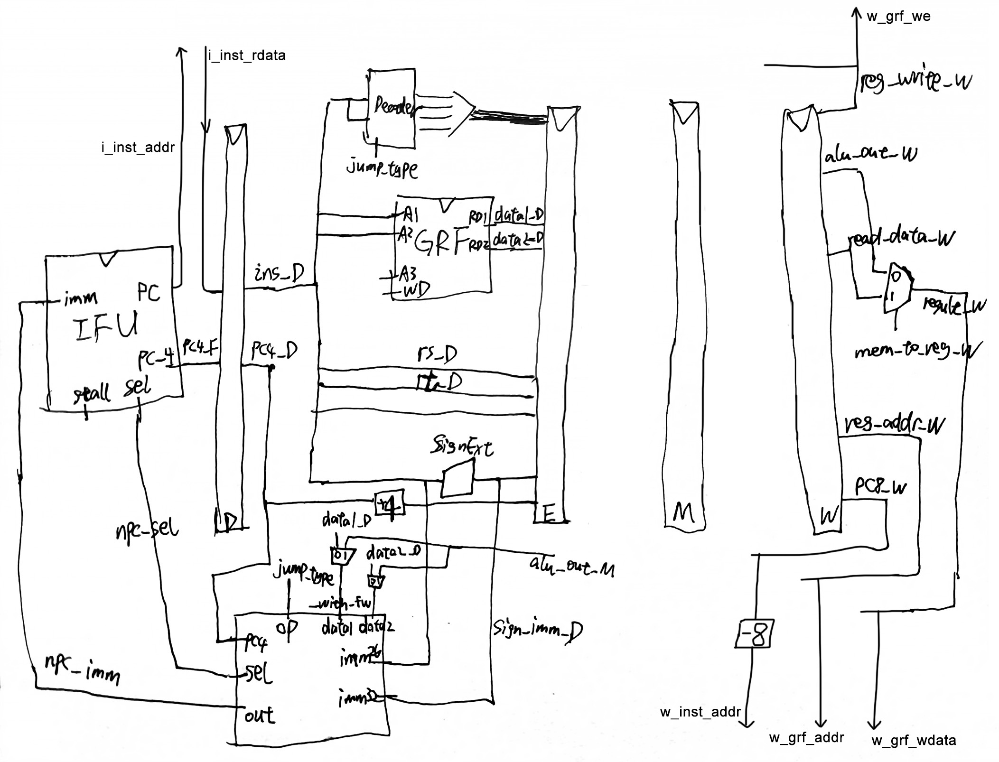
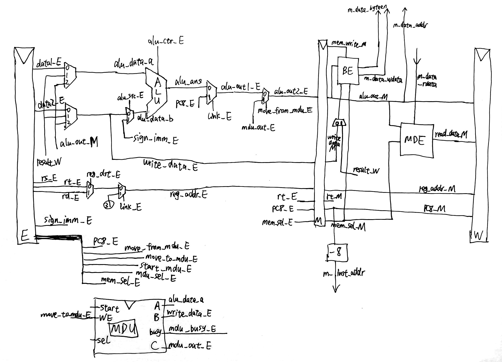
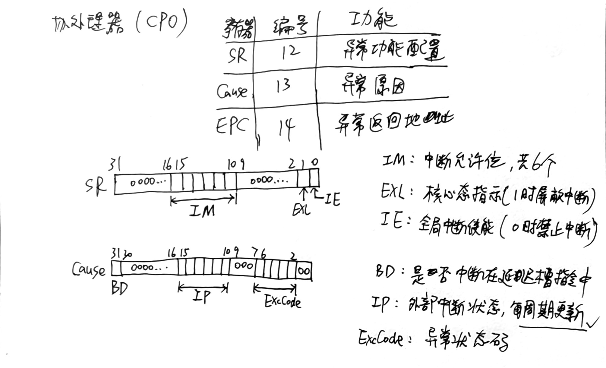

## 设计草稿

**支持的指令：**

```
add, sub, and, or, slt, sltu, lui
addi, andi, ori
lb, lh, lw, sb, sh, sw
mult, multu, div, divu, mfhi, mflo, mthi, mtlo
beq, bne, jal, jr
mtc0, mfc0, eret, syscall
```

**注意点：**

* 复位信号reset采用**同步复位**方式
* `CP0`寄存器位于**M级**，即**宏观PC为M级PC**
* 由于中断发生器内部无存储单元，读出的数据需始终保持 0
* Cause 寄存器的 IP 域每周期写入 HWint 对应位的值
* CP0 寄存器的初始值均为 0，未实现位始终保持 0
* 在进入中断或异常状态时，如果受害指令及其后续指令**已经改变**了MDU的状态，则**无需恢复**；若此时后续指令**正要改变**MDU的状态，或受害指令**正要写**内存，则**需要中断该操作**
* 分支跳转指令无论跳转与否，延迟槽指令的`延迟槽标记`均需要置位
* 跳转到不对齐的地址时，受害指令是 PC 值不正确的指令（即需要向 EPC 写入不对齐的地址）
* 中断请求有效时，全部流水线PC寄存器（包括F级PC寄存器）复位到`0x0000_4180`；复位时，全部流水线PC寄存器（包括F级PC寄存器）复位到`0x0000_3000`
* **流水线寄存器在清空时，PC与延迟槽标记仍正常流水**，即空泡指令PC、延迟槽标记为紧跟着后一条指令取值

**微系统结构（引用自教程）：**


**数据通路图：**




**地址分配：**

|         条目         |      地址或地址范围       |
| :------------------: | :-----------------------: |
|      数据存储器      | 0x0000_0000 ∼ 0x0000_2FFF |
|      指令存储器      | 0x0000_3000 ∼ 0x0000_6FFF |
|      PC 初始值       |        0x0000_3000        |
| 异常处理程序入口地址 |        0x0000_4180        |
| 计时器 0 寄存器地址  | 0x0000_7F00 ∼ 0x0000_7F0B |
| 计时器 1 寄存器地址  | 0x0000_7F10 ∼ 0x0000_7F1B |
|  中断发生器响应地址  | 0x0000_7F20 ∼ 0x0000_7F23 |

**异常/中断码：**

| 异常与中断码 |        助记符与名称        |    指令与指令类型    | 描述                                             |
| :----------: | :------------------------: | :------------------: | :----------------------------------------------- |
|      0       |     `Int`（外部中断）      |       所有指令       | 中断请求，来源于计时器与外部中断                 |
|      4       |  `AdEL`<br/>（取指异常）   |       所有指令       | PC地址未字对齐<br/>PC地址超过`0x3000 ~ 0x6ffc`   |
|      4       |  `AdEL`<br/>（取数异常）   |         `lw`         | 取数地址未与4字节对齐                            |
|      4       |  `AdEL`<br/>（取数异常）   |         `lh`         | 取数地址未与2字节对齐                            |
|      4       |  `AdEL`<br/>（取数异常）   |      `lh`、`lb`      | 取Timer寄存器的值                                |
|      4       |  `AdEL`<br/>（取数异常）   |      load型指令      | 计算地址时加法溢出                               |
|      4       |  `AdEL`<br/>（取数异常）   |      load型指令      | 取数地址超出DM、Timer0、Timer1、中断发生器的范围 |
|      5       |  `AdES`<br/>（存数异常）   |         `sw`         | 存数地址未与4字节对齐                            |
|      5       |  `AdES`<br/>（存数异常）   |         `sh`         | 存数地址未与2字节对齐                            |
|      5       |  `AdES`<br/>（存数异常）   |      `sh`、`sb`      | 存Timer寄存器的值                                |
|      5       |  `AdES`<br/>（存数异常）   |     store型指令      | 计算地址时加法溢出                               |
|      5       |  `AdES`<br/>（存数异常）   |     store型指令      | 向计时器的Count寄存器存值                        |
|      5       |  `AdES`<br/>（存数异常）   |     store型指令      | 存数地址超出DM、Timer0、Timer1、中断发生器的范围 |
|      8       | `Syscall`<br/>（系统调用） |      `syscall`       | 系统调用                                         |
|      10      |      `RI`（未知指令）      |          -           | 未知的指令码                                     |
|      12      |      `Ov`（溢出异常）      | `add`, `addi`, `sub` | 算术溢出                                         |

**CP0（0号协处理器）：**

* EPC支持内部转发
* imer0 输出的中断信号接入 HWInt[0] (最低中断位)，Timer1 输出的中断信号接入 HWInt[1]，来自中断发生器的中断信号接入 HWInt[2]



**IFU（取指令单元/F级寄存器）：**

* 内部包括 PC（程序计数器）及相关逻辑
* PC 用寄存器实现，具有复位功能，复位值为起始地址
* 通过`sel`控制信号（来自`NPC`模块）选择下一条指令的地址，0时nextPC默认+4，1时从`NPC`接收32位`imm`作为nextPC
* **支持通过`Stall`控制信号阻塞PC更新，即阻塞F级**
* IM模块已引出，由外部实现
* 支持取指异常

**NpcController（NextPC计算单元）：**

* 接收来自`Decoder`的`jump_type`（4位）控制信号，选择NextPC计算方式
* 用于计算、判断的输入有`data1_with_fw`、`data2_with_fw`（来自`GRF`+M级转发），imm26、imm32，epc

| 控制信号[3:0] |                         NPC计算方式                         | 延迟槽 |
| :-----------: | :---------------------------------------------------------: | :----: |
|   JUMP_NONE   |                        npc = pc + 4                         |   0    |
|   JUMP_BEQ    | npc = (data1==data2) ? (pc + 4 + (imm32 \|\|00)) : (pc + 4) |   1    |
|   JUMP_BNE    | npc = (data1!=data2) ? (pc + 4 + (imm32 \|\|00)) : (pc + 4) |   1    |
|   JUMP_JAL    |             npc = pc[31:28] \|\| imm26 \|\| 00              |   1    |
|    JUMP_JR    |                         npc = data1                         |   1    |
|   JUMP_ERET   |                  npc = EPC，同时清空延迟槽                  |   0    |

**GRF（通用寄存器组）：**

* 用具有写使能的寄存器实现，寄存器总数为 32 个，具有复位功能
* 0 号寄存器的值始终保持为 0。其他寄存器初始值（复位后）为 0
* **支持内部转发，即当写使能启用且读寄存器与写寄存器相同时（0号寄存器除外），应先在对应端口输出写数据**

**ALU（算术逻辑单元）：**

* 通过`op`控制信号（4位）选择对应的计算功能，具体见下表
* 支持多种异常
* `ALUOP_ADD`现有为计算地址产生异常的衍生信号，不再赘述

| 控制信号[3:0] |              ALU功能              |
| :-----------: | :-------------------------------: |
|   ALUOP_ADD   |          带异常符号加法           |
|  ALUOP_ADDU   |            无符号加法             |
|   ALUOP_SUB   |          带异常符号减法           |
|   ALUOP_ORI   | 寄存器值按位或立即数（高16位补0） |
|   ALUOP_LUI   |  立即数置输出高16位（低16位补0）  |
|   ALUOP_AND   |              按位与               |
|   ALUOP_OR    |              按位或               |
|  ALUOP_ANDI   | 寄存器值按位与立即数（高16位补0） |
|   ALUOP_SLT   |        小于置位（有符号）         |
|  ALUOP_SLTU   |        小于置位（无符号）         |

**MDU（乘除法模块）：**

* 乘法运算需要5个时钟周期，除法运算需要10个时钟周期
* 使用`start`信号与`sel`信号选择计算方式并开启计算
* 当`busy`信号或`start`信号为1时，`mfhi`、`mflo`指令将被阻塞在D流水级
* 允许`mult`、`div`、`mthi`等指令打断正在运行的过程并覆盖过程

当`start`信号为1时，`sel`信号选择的计算方式如下表：

| 控制信号[2:0]  |     MDU功能      |
| :------------: | :--------------: |
| MULDIV_DO_MUL  |    有符号乘法    |
| MULDIV_DO_MULU |    无符号乘法    |
| MULDIV_DO_DIV  | 有符号整除、取模 |
| MULDIV_DO_DIVU | 无符号整除、取模 |

**BE（字节使能模块）：**

已引出到系统桥。

对待写入内存的寄存器数据进行预处理，并输出字节使能信号到外置DM。选择信号与MDE模块共用。具体见下表

| MemWrite |  MemSel[2:0]   | AddrLow[1:0] | ByteEn[3:0] |      数据处理方式      |
| :------: | :------------: | :----------: | :---------: | :--------------------: |
|    1     | MEM_STORE_WORD |      -       |    1111     |         不处理         |
|    1     | MEM_STORE_HALF |      0x      |    0011     |         不处理         |
|    1     | MEM_STORE_HALF |      1x      |    1100     | {RawData[15:0], 16'b0} |
|    1     | MEM_STORE_BYTE |      00      |    0001     |         不处理         |
|    1     | MEM_STORE_BYTE |      01      |    0010     | {RawData[23:0], 8'b0}  |
|    1     | MEM_STORE_BYTE |      10      |    0100     | {RawData[15:0], 16'b0} |
|    1     | MEM_STORE_BYTE |      11      |    1000     | {RawData[7:0], 24'b0}  |
|    0     |       -        |      -       |    0000     |           -            |

**DM（数据存储器）：**已引出，由外部实现

**MDE（内存读取扩展模块）：**

已引出到系统桥。

对从内存读出的数据进行处理。选择信号与BE模块共用。具体见下表

|  MemSel[2:0]  | AddrLow[1:0] |        数据处理方式        |
| :-----------: | :----------: | :------------------------: |
| MEM_LOAD_WORD |      -       |           不处理           |
| MEM_LOAD_HALF |      0x      | signed_ext(RawData[15:0])  |
| MEM_LOAD_HALF |      1x      | signed_ext(RawData[31:16]) |
| MEM_LOAD_BYTE |      00      |  signed_ext(RawData[7:0])  |
| MEM_LOAD_BYTE |      01      | signed_ext(RawData[15:8])  |
| MEM_LOAD_BYTE |      10      | signed_ext(RawData[23:16]) |
| MEM_LOAD_BYTE |      11      | signed_ext(RawData[31:24]) |

**Decoder（译码器）：**

* 采用聚焦于**控制信号每种取值所对应的指令**的方式
* 支持多种异常
* 新增`mfc0`、`mtc0`、`eret`、`ExcCode`信号，不再列表

| 指令 \ 控制信号 | RegDst | MemToReg | ALUCtr[3:0] | ALUSrc | RegWrite | MemWrite |   JType[3:0]   | Link |
| :-------------: | :----: | :----: | :-------: | :----: | :------: | :------: | :--------: | :-------: |
|       add       |   1   |   0   | ALUOP_ADD |   0    |    1     |    0     |  JUMP_NONE  |0|
|       sub       |   1   |   0   | ALUOP_SUB |   0    |    1     |    0     |  JUMP_NONE  |0|
|       lui       |   0   |   0   | ALUOP_LUI |   1    |    1     |    0     |  JUMP_NONE  |0|
|       ori       |   0   |   0   | ALUOP_ORI |   1    |    1     |    0     |  JUMP_NONE  |0|
|       beq       |   -    |   -    |     -     |   -    |    0     |    0     | JUMP_BEQ |-|
| bne | - | - | - | - | 0 | 0 | JUMP_BNE |-|
|       nop       |   -    |   -    |     -     |   -    |    0     |    0     |  JUMP_NONE  |-|
|       jal       | - | 0 |     -     | - |    1     |    0     | JUMP_JAL |1|
|       jr        | - | - |      -      | - |    0     |    0     |  JUMP_JR  |-|
|       and       |   1   |   0   | ALUOP_AND |   0    |    1     |    0     |  JUMP_NONE  |0|
| or | 1 | 0 | ALUOP_OR | 0 | 1 | 0 | JUMP_NONE |0|
| andi | 0 | 0 | ALUOP_ANDI | 1 | 1 | 0 | JUMP_NONE |0|
| addi | 0 | 0 | ALUOP_ADD | 1 | 1 | 0 | JUMP_NONE |0|
| slt | 1 | 0 | ALUOP_SLT | 0 | 1 | 0 | JUMP_NONE |0|
| sltu | 1 | 0 | ALUOP_SLTU | 0 | 1 | 0 | JUMP_NONE |0|

| 指令 \ 控制信号 | MemSel | RegDst | MemToReg | RegWrite | MemWrite | ALUCtr[3:0] | ALUSrc |
| :-------------: | :--------: | :----: | :----: | :-------: | :----: | :------: | :-------------: |
| sw | MEM_STORE_WORD | - | - | 0 | 1 | ALUOP_ADD_STORE | 1 |
| lw | MEM_LOAD_WORD | 0 | 1 | 1 | 0 | ALUOP_ADD_LOAD | 1 |
| sh | MEM_STORE_HALF | - | - | 0 | 1 | ALUOP_ADD_STORE | 1 |
| lh | MEM_LOAD_HALF | 0 | 1 | 1 | 0 | ALUOP_ADD_LOAD | 1 |
| sb | MEM_STORE_BYTE | - | - | 0 | 1 | ALUOP_ADD_STORE | 1 |
| lb | MEM_LOAD_BYTE | 0 | 1 | 1 | 0 | ALUOP_ADD_LOAD | 1 |
| 其他指令 | - | … | 0 | … | 0 | … | … |

| 指令 \ 控制信号 | MoveFromMDU | MoveToMDU | MDUSel[2:0] | StartMDU | RegDst | RegWrite |
| :-------------: | :----: | :----: | :-------: | :----: | :------: | :--------: |
| mult | 0 | 0 | MULDIV_DO_MUL | 1 | - | 0 |
| multu | 0 | 0 | MULDIV_DO_MULU | 1 | - | 0 |
| div | 0 | 0 | MULDIV_DO_DIV | 1 | - | 0 |
| divu | 0 | 0 | MULDIV_DO_DIVU | 1 | - | 0 |
| mfhi | 1 | 0 | MULDIV_SELECT_HI | 0 | 1 | 1 |
| mflo | 1 | 0 | MULDIV_SELECT_LO | 0 | 1 | 1 |
| mthi | 0 | 1 | MULDIV_SELECT_HI | 0 | - | 0 |
| mtlo | 0 | 1 | MULDIV_SELECT_LO | 0 | - | 0 |
| 其他指令 | 0 | 0 | - | 0 | … | … |

| 指令 \ 控制信号 | RsUsage[1:0] | RtUsage[1:0] |
| :-------------: | :----: | :----: |
| add / sub | VALUE_USE_NEXT | VALUE_USE_NEXT |
| lui | VALUE_USE_NONE | VALUE_USE_NONE |
| ori | VALUE_USE_NEXT | VALUE_USE_NONE |
| sw / sh / sb | VALUE_USE_NEXT | VALUE_USE_NONE[^1] |
| lw / lh / lb | VALUE_USE_NEXT | VALUE_USE_NONE |
| beq | VALUE_USE_NOW | VALUE_USE_NOW |
| bne | VALUE_USE_NOW | VALUE_USE_NOW |
| nop / sll | VALUE_USE_NEXT[^2] | VALUE_USE_NEXT[^2] |
| jal | VALUE_USE_NONE | VALUE_USE_NONE |
| jr | VALUE_USE_NOW | VALUE_USE_NONE |
| and / or | VALUE_USE_NEXT | VALUE_USE_NEXT |
| andi | VALUE_USE_NEXT | VALUE_USE_NONE |
| addi | VALUE_USE_NEXT | VALUE_USE_NONE |
| slt / sltu | VALUE_USE_NEXT | VALUE_USE_NEXT |
| mult / multu / div /divu | VALUE_USE_NEXT | VALUE_USE_NEXT |
| mfhi / mflo[^3] | VALUE_USE_NONE | VALUE_USE_NONE |
| mthi / mtlo | VALUE_USE_NEXT | VALUE_USE_NONE |
| mtc0 | VALUE_USE_NONE[^4] | VALUE_USE_NONE |
| mfc0 / syscall / eret | VALUE_USE_NONE | VALUE_USE_NONE |

[^1]: `sw/sh/sb`指令的`rt`值在M级才会使用到，此时其前序指令均已计算/取出完成，可通过W->M转发保证正确性，故使用`VALUE_USE_NONE`
[^2]: `nop`为特殊的`sll`指令，由于`rs`、`rt`寄存器均为0，故不会触发阻塞
[^3]: 使用独立于`RsUsage`、`RtUsage`之外的判据进行阻塞判定（`MoveFromMDU`、`StartMDU`、`MoveToMDU`与`MDUBusy`）

[^4]: `mtc0`的`rs`值在M级才会使用到，此时其前序指令均已计算/取出完成，可通过W->M转发保证正确性，故使用`VALUE_USE_NONE`

**ConflictController（冲突处理器）：**

* 阻塞优先级总是大于转发、清空（如有）等冲突处理操作
* 来自前序的转发优先级大于更前序几级（就近法则）
* 当满足转发条件时（0号寄存器除外），总是进行转发，即可能存在多余/错误的转发但由于阻塞或写使能未启用，未对实际状态产生错误影响。具体进行转发的级有`M->E`、`W->E`、`W->M`、`M->D`（跳转提前计算），`W->D`为特殊的GRF内部转发
* 总是将指令阻塞在D级，同时F级也阻塞，E级清空（即插入指令空泡）
* 采用改进版AT法判定阻塞条件，保留`A`因素（0号寄存器除外），弱化`Tuse`属性成`VALUE_USE_NOW`、`VALUE_USE_NEXT`、`VALUE_USE_NONE`三种信号并使用`RegWrite`与`MemToReg`控制信号代替`Tnew`属性进行判定
* 对于乘除器的阻塞，使用D级的`MoveFromMDU`信号与E级的`StartMDU`、`MoveToMDU`与`MDUBusy`信号进行额外的判定
* 注意处理`mtc0-eret`、`mfc0`产生的数据冒险，需要阻塞

**StageX（流水线寄存器）：**

* `reset`复位信号优先级最高，`req`中断清空请求其次，`stall`阻塞再次、`flush`清空最低

* **额外流水PC值、异常码、延迟槽标记、CP0相关指令控制信号**

* StageF（取指）：实际上为PC寄存器，支持**Stall阻塞**、**Req中断清空**
* StageD（译码）：支持**Stall阻塞**、**Req中断清空**、**Flush清空延迟槽**
* StageE（执行）：支持**Req中断清空**、**Flush清空**
* StageM（访存）：支持**Req中断清空**
* StageW（回写）：支持**Req中断清空**

## 思考题

### Q：请查阅相关资料，说明鼠标和键盘的输入信号是如何被 CPU 知晓的？

A：鼠标与键盘即所谓的“外设”，它们通过USB、PS/2等接口接入计算机的主板，这时操作系统中的驱动软件会通过MMIO、Port IO等方式与这些硬件进行通信并建立连接。这些外设的输入信号随后可以通过主动发送中断，或系统定时中断轮询的方式将输入信号送入CPU，再由驱动程序对信号进行处理。

### Q：请思考为什么我们的 CPU 处理中断异常必须是已经指定好的地址？如果你的 CPU 支持用户自定义入口地址，即处理中断异常的程序由用户提供，其还能提供我们所希望的功能吗？如果可以，请说明这样可能会出现什么问题？否则举例说明。（假设用户提供的中断处理程序合法）

A：指定地址使异常处理流程具有统一性，也可以简化CPU设计的复杂程度。如果CPU支持用户自定义入口地址，则仍然可以正常提供功能，可能的问题是会与设计者期望的异常处理方式发生冲突，可能对CPU后续执行产生影响。

### Q：为何与外设通信需要 Bridge？

A：根据**高内聚、低耦合**的设计原则，CPU的设计相对固定，而外设则多种多样，可能随时间不断变化，这就需要抽象出“系统桥”作为CPU与外设之间的**接口**，这样CPU就能通过统一、固定的方式去访问外设。如果外设的通信或设计发生变化，无需重新设计CPU结构，只需改进系统桥的设计即可。

### Q：请阅读官方提供的定时器源代码，阐述两种中断模式的异同，并分别针对每一种模式绘制状态移图。

A：模式0：计数器减为0时，计数器停止记数，使能自动置0，中断信号持续有效；多用于产生单次定时中断。模式1：计数器减为0时，计数器复位到初值，产生1周期的中断信号；多用于产生周期性循环中断。



### Q：倘若中断信号流入的时候，在检测宏观 PC 的一级如果是一条空泡（你的 CPU 该级所有信息均为空）指令，此时会发生什么问题？在此例基础上请思考：在 P7 中，清空流水线产生的空泡指令应该保留原指令的哪些信息？

A：发生中断时，受害指令的PC值将被存入CP0寄存器。如果宏观PC一级是空泡且不含任何信息，则CP0读到的EPC值将会是**空**，这可能对后续的异常处理流程造成不良影响，最后ERET返回时也将返回到错误的指令地址。空泡指令应当保留原指令（实际上是被阻塞的指令）的PC值信息与延迟槽标记。

### Q：为什么 `jalr` 指令的两个寄存器不能相同，例如 `jalr $31, $31`？

A：如果两个寄存器相同，若当前宏观PC位于`jalr`指令的延迟槽，且中断正好发生时，按要求在异常处理程序返回后需重新执行`jalr`指令，而此时这个重复的寄存器的值已经被修改，两次执行的结果不同。如果`jalr`的寄存器不同，则重新执行时不会发生这个问题。

### Q：请详细描述你的测试方案及测试数据构造策略

A：**测试异常：**`add`、`sub`、`addi`产生算数异常；`syscall`产生SYSCALL异常；用`jal`、`jr`与运算指令构造不对齐、超范围PC引发AdEL异常；`lw`、`lh`不对齐引发AdEL异常，`lh`、`lb`取Timer异常，load型指令加法溢出异常，load型指令超范围异常；`sw`、`sh`不对齐引发AdES异常，`sh`、`sb`存Timer异常，存Timer的Count寄存器异常，store型指令加法溢出异常，store型指令超范围异常；手动构造不在指令集中的机器码引发RI异常；异常指令后紧跟`mthi`、`mtlo`、`mult`、`div`等指令，配合handler测试指令是否错误执行。**测试中断：**写SR寄存器的中断允许位、全局中断使能测试中断开关功能；进入handler后继续给中断测试是否正常屏蔽；中断受害指令后紧跟`mthi`、`mult`等指令，或受害指令为`sw`、`sh`等指令，配合handler测试是否错误执行；在宏观PC为延迟槽指令时给予中断，测试EPC取值是否正常；在宏观PC为空泡指令时给予中断，测试EPC取值是否正常。
