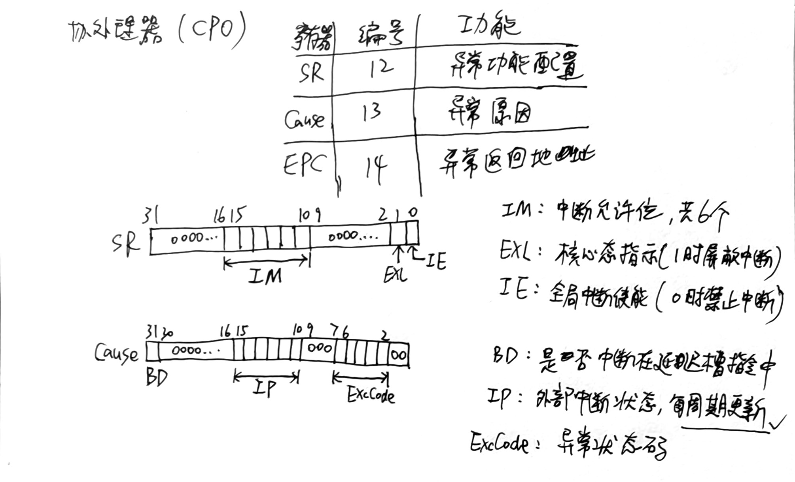

## 设计草稿

**设计参数：**五级流水线CPU，主频50MHz，内置定时器x1。支持如下指令：

```
add, sub, and, or, slt, sltu, lui
addu, subu, addi, addiu, andi, ori
lb, lh, lw, sb, sh, sw
mult, multu, div, divu, mfhi, mflo, mthi, mtlo
beq, bne, jal, jr
mtc0, mfc0, eret, syscall
```

**微系统结构（引用自教程）：**



**地址分配：**

|         条目         |      地址或地址范围       |
| :------------------: | :-----------------------: |
|      PC 初始值       |        0x0000_3000        |
| 异常处理程序入口地址 |        0x0000_4180        |
|      数据存储器      | 0x0000_0000 ∼ 0x0000_2FFF |
|      指令存储器      | 0x0000_3000 ∼ 0x0000_6FFF |
|   计时器寄存器地址   | 0x0000_7F00 ∼ 0x0000_7F0B |
|   UART 寄存器地址    | 0x0000_7F30 ∼ 0x0000_7F3F |
|   数码管寄存器地址   | 0x0000_7F50 ∼ 0x0000_7F57 |
|     拨码开关地址     | 0x0000_7F60 ∼ 0x0000_7F67 |
|     按键开关地址     | 0x0000_7F68 ∼ 0x0000_7F6B |
|    LED 寄存器地址    | 0x0000_7F70 ∼ 0x0000_7F73 |

**UART 寄存器定义：**

| 偏移(以字为单位) | 寄存器名称 |                          寄存器描述                          | R/W  |                    复位值                    |
| :--------------: | :--------: | :----------------------------------------------------------: | :--: | :------------------------------------------: |
|      `0x0`       |   `DATA`   | 数据寄存器 仅低 8 位(一个字节)可用。 写入表示发送 UART 数据 读取表示接收 UART 数据 | R/W  |                      0                       |
|      `0x1`       |   `LSR`    | 状态寄存器 第 0 位表示接收状态， 第 5 位表示发送状态， 其他位未定义。<br/>发送状态：0 为忙碌（正在发送数据），1 为空闲（可以发送新数据）；接收状态：0 表示数据无效，1 表示数据有效。 |  R   | 定义位均为 1 即发送接收均空闲 未定义位不确定 |
|      `0x2`       |   `DIVR`   |                         接收除数因子                         | R/W  |                    不确定                    |
|      `0x3`       |   `DIVT`   |                         发送除数因子                         | R/W  |                    不确定                    |

**异常/中断码：**

| 异常与中断码 |        助记符与名称        |    指令与指令类型    | 描述                                             |
| :----------: | :------------------------: | :------------------: | :----------------------------------------------- |
|      0       |     `Int`（外部中断）      |       所有指令       | 中断请求，来源于计时器与外部中断                 |
|      4       |  `AdEL`<br/>（取指异常）   |       所有指令       | PC地址未字对齐<br/>PC地址超过`0x3000 ~ 0x6ffc`   |
|      4       |  `AdEL`<br/>（取数异常）   |         `lw`         | 取数地址未与4字节对齐                            |
|      4       |  `AdEL`<br/>（取数异常）   |         `lh`         | 取数地址未与2字节对齐                            |
|      4       |  `AdEL`<br/>（取数异常）   |      `lh`、`lb`      | 取Timer寄存器的值                                |
|      4       |  `AdEL`<br/>（取数异常）   |      load型指令      | 计算地址时加法溢出                               |
|      4       |  `AdEL`<br/>（取数异常）   |      load型指令      | 取数地址超出DM、Timer0、Timer1、中断发生器的范围 |
|      5       |  `AdES`<br/>（存数异常）   |         `sw`         | 存数地址未与4字节对齐                            |
|      5       |  `AdES`<br/>（存数异常）   |         `sh`         | 存数地址未与2字节对齐                            |
|      5       |  `AdES`<br/>（存数异常）   |      `sh`、`sb`      | 存Timer寄存器的值                                |
|      5       |  `AdES`<br/>（存数异常）   |     store型指令      | 计算地址时加法溢出                               |
|      5       |  `AdES`<br/>（存数异常）   |     store型指令      | 向计时器的Count寄存器存值                        |
|      5       |  `AdES`<br/>（存数异常）   |     store型指令      | 存数地址超出DM、Timer0、Timer1、中断发生器的范围 |
|      8       | `Syscall`<br/>（系统调用） |      `syscall`       | 系统调用                                         |
|      10      |      `RI`（未知指令）      |          -           | 未知的指令码                                     |
|      12      |      `Ov`（溢出异常）      | `add`, `addi`, `sub` | 算术溢出                                         |

**CP0（0号协处理器）：**



## 乘除器接入方案

简单来说就是做封装。观察提供的乘除器代码，主要需要考虑的是`out_ready`、`out_valid`、`in_ready`、`in_valid`四个端口，我的设计中，当`out_valid`为1，即出运算结果时，外部封装模块的HI、LO寄存器在下一周期存入输出的结果，因此`out_ready`接入始终为1。`in_ready`则与外部模块的`busy`信号互补，`in_valid`与向外部模块输入的`start`信号一致。受实际乘除器的限制，在运算过程中无法再接收新的指令，因此修改阻塞控制器，在乘除器运算进行时任何与乘除器相关的指令都被阻塞。

## 外设驱动模块方案

通用IO与数码管驱动模块设计较为简单，内置多个寄存器用于控制输出，利用组合逻辑读入写操作数据到寄存器，或根据地址与字节使能选择外设信号电平/寄存器输出，支持按字节读写。其中数码管驱动内含译码逻辑，将输出数据寄存器的值译码为对应8位字符显示信号；驱动还内置简易计数器，按一定周期数更新数码管选择信号与输出信号，利用视觉暂留原理达到所有数码管“同时显示”的效果。

UART串口驱动的寄存器读/写设计与上述驱动类似，但只支持按字读写。较复杂的部分则是合理将提供的`uart_tx`与`uart_rx`子模块与驱动连接。UART是一种全双工通信协议，因此发送端与接收端并无直接关联，需要注意的端口是`tx_start`、`tx_avai`、`rx_clear`、`rx_ready`。`tx_start`表示需要发送端开始传输数据，`rx_clear`表示数据接收完成，这两个端口可以利用组合逻辑给出电平值，与P7中端发生器根据地址与字节使能判断响应的原理类似，当读取内存操作时即表示串口读取完成，写内存操作时表示要发送数据；注意UART的DATA寄存器是一个*复用端口*，实际上并不存在实际的寄存器，写内存时输入驱动的数据直通`tx_data`，读内存时驱动输出的数据选自`rx_data`。`tx_avai`与`rx_ready`则表示发送、接收端的空闲状态，在取内存地址匹配LSR寄存器地址时直接输出这两个信号，供软件程序轮询串口状态。此外，UART串口驱动还支持中断，`rx_ready`为1时表示接受到了数据，因此可以直接作为中断信号用。

## 设计时遇到的问题与解决思路

主要问题是存储器使用的IP核的BROM/BRAM，这使原本设计的IM/DM异步读同步写变成了同步读同步写。根据教程给出的方案，经过我自己的仔细思考，我修改了D级流水线寄存器、W级流水线寄存器与系统桥的设计。其中W级流水线寄存器的“内存读出数据”信号不再是寄存器，输入直通输出；系统桥则在一定修改后整体变成同步读，与DM特点相匹配。D级流水线寄存器同样将“指令读出数据”信号改为直通，但需要注意的是，要额外考虑阻塞、清空情况，此时输出端口不能再直接连接输入，而是要保留上一次输出信号或输出0。

Hodgepodge一题的计算器模式要求加减法忽略溢出，因此我根据实际需要给原本CPU加入了`addu`、`subu`、`addiu`指令的支持。要求UART串口具有回显功能，则采用中断实现：在中断例程中判断有来自串口的中断后，立即读取接收到的数据并发送。

此外，我在查看时序分析时，发现乘除法模块，尤其乘法模块相关的关键路径较长，阅读代码后发现乘法模块对输出的源操作数直接以`wire`相连用`*`计算。在与几位助教交流讨论后，我修改了乘法模块的部分实现，对输出的源操作数先进行一周期的暂存（写入内置寄存器），之后再进行一周期的乘法操作，用2个周期的运算，一级对输入的缓冲，阻断了来自乘除法模块外部输入可能较长的路径，缩短了CPU整体的关键路径。

## 外设汇编驱动程序

直接附Hodgepodge一题相关代码实现（有删减），含注释

```assembly
......
.text
#=====clear peripheral=====
addiu $t0, $0, -1
ori $t2, $0, 0x7F70 # LED
sw $t0, 0($t2)
ori $t2, $0, 0x7F50 # tube
sw $0, 0($t2)
sb $0, 4($t2)
ori $t0, $0, 0x7F00 # timer
lui $t1, 0x2FA
ori $t1, $t1, 0xF080
sw $t1, 4($t0) # count = 1s/20ns=5x10^7=0x02FAF080
#=====set UART baud-rate=====
ori $t2, $0, 0x7F30 # UART
ori $t1, $0, 2604 # DIVR=DIVT=1s/19200b/20ns
sw $t1, 8($t2)
sw $t1, 12($t2)

......
#=====entry point=====
ori $t1, $0, 0x2401 # accept timer & uart irq
mtc0 $t1, $12

......
#=========timer mode=========
......

timer_reset:
	sw $t1, timer_keystate
	beq $t1, $0, reset_0
	ori $t0, $0, 0x7F00 # timer
	#reset_non_0:
		sw $0, 0($t0) # stop timer
		ori $a1, $0, 0 # initial value
		ori $a2, $t1, 0 # final value
		ori $a3, $0, 1 # loop step
		ori $t2, $0, 0x9 # set timer mode 0
		sw $t2, 0($t0) # start timer
		
......
#=========calculator mode=========
......

ori $t0, $0, 0x7F68
lw $t3, -4($t0) # key group 7~4
addiu $t2, $0, -1 # 01 turn-over
subu $t3, $t2, $t3
lw $t4, -8($t0) # key group 3~0
subu $t4, $t2, $t4
......

func_output: # a0=num
	ori $t0, $0, 0x7F68 # 8-buttons
	lw $t1, 0($t0)
	addiu $t0, $0, -1 # 01 turn-over
	subu $t1, $t0, $t1
	andi $t1, $t1, 0x2
	beq $t1, $0, digital_out
	nop
	#uart_out:
		ori $t0, $0, 0x7F50 # tubes
		addiu $t1, $0, -1
		sw $0, 0($t0) # tube-num
		sw $t1, 32($t0) # LED
		sw $a0, output_buf
		ori $t0, $0, 0x7F30 # uart
		ori $t3, $0, 4
		loop_sending:
			loop_uart_pending:
			lw $t1, 4($t0)
			andi $t1, $t1, 0x20 # tx available?
			beq $t1, $0, loop_uart_pending
			nop
			addiu $t3, $t3, -1
			lb $t1, output_buf($t3)
			sw $t1, 0($t0)
			bne $t3, $0, loop_sending
			nop
		jr $ra
		nop
	digital_out:
......
.ktext 0x4180
......
#=====set timer notify=====
mfc0 $s0, $13
andi $s0, $s0, 0x400 # timer irq?
beq $s0, $0, kecho_uart
nop
ori $s0, $0, 1
sw $s0, timer_notify
ori $s0, $0, 0x7F00 # timer
lw $s1, 0($s0)
ori $s1, $s1, 1
sw $s1, 0($s0) # restart timer

kecho_uart:
#=====echo uart input out=====
ori $s0, $0, 0x7F30
lw $s1, 4($s0)
andi $s1, $s1, 0x1 # rx ready?
beq $s1, $0, kexit
nop
lw $s2, 0($s0)
kloop_uart_pending:
lw $s1, 4($s0)
andi $s1, $s1, 0x20 # tx available?
beq $s1, $0, kloop_uart_pending
nop
sw $s2, 0($s0)
kexit:
eret
......
```

